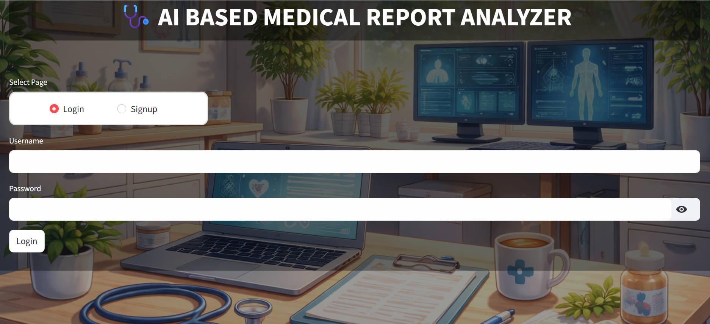
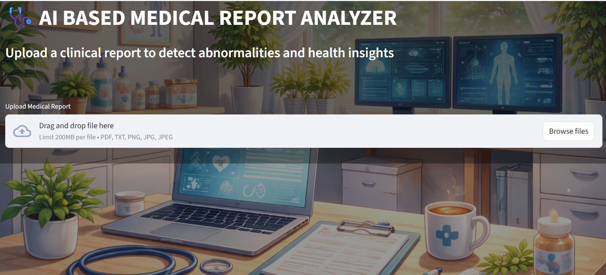
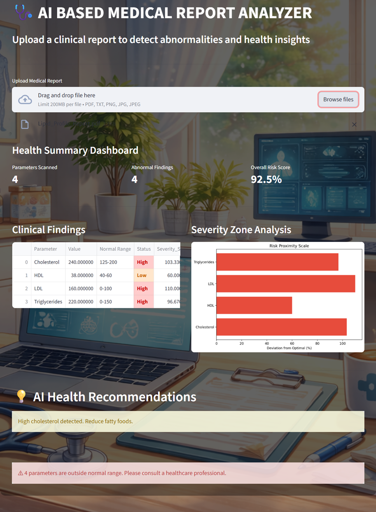
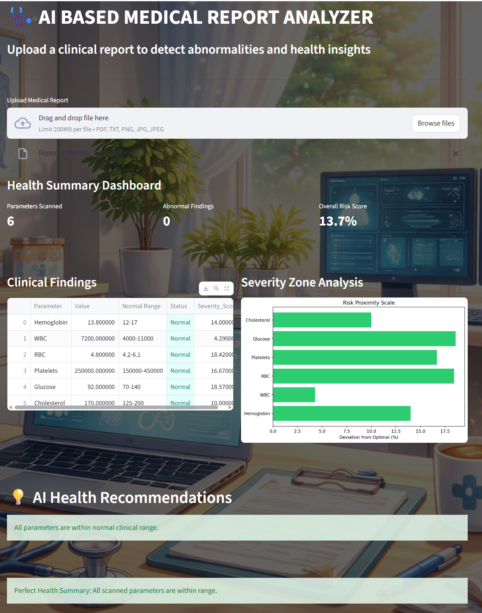
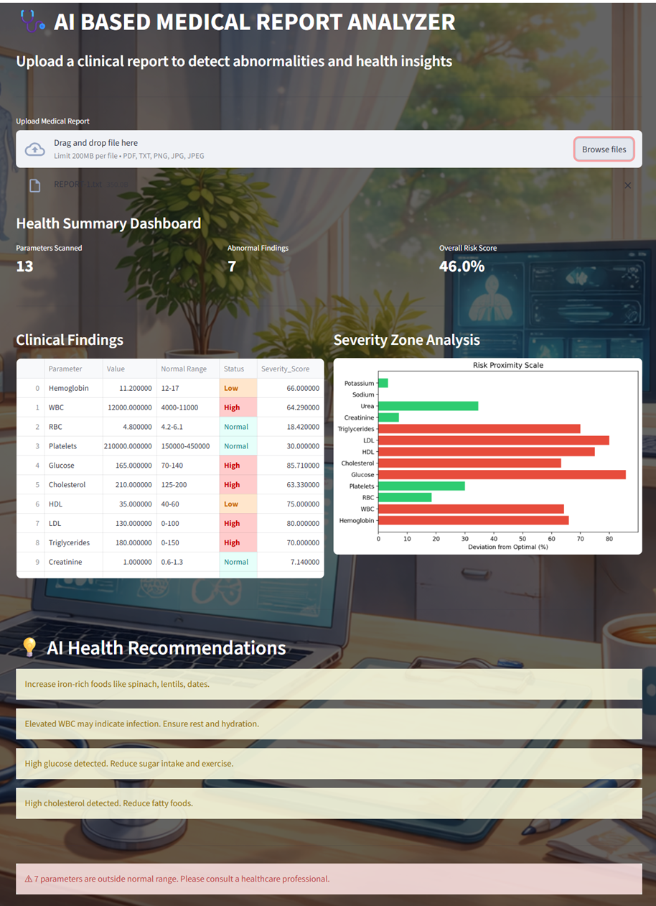

# AI-Based Medical Report Analyzer

> *"Upload your report. Understand your health. Instantly."*

An intelligent Streamlit web application that reads clinical lab reports and delivers instant health insights — detecting abnormal parameters, calculating risk scores, and providing AI-powered recommendations.

---

## Preview

### Login Page


### Health Dashboard


### Analysis Report-1


### Analysis Report-2


### Analysis Report-3


---

##  What It Does

| Feature | Description |
|---|---|
|  Multi-format Upload | Supports PDF, TXT, JPG, PNG lab reports |
|  Auto Parameter Detection | Detects values like Hemoglobin, WBC, Glucose, Cholesterol |
|  Status Classification | Flags each parameter as Normal / High / Low |
|  Severity Score | Calculates % deviation from optimal range |
|  Health Recommendations | AI-generated suggestions based on findings |
|  User Auth | Secure login & signup system |

---

##  Tech Stack

```
Language      →  Python 3.x
Frontend      →  Streamlit
Data          →  Pandas · NumPy
Visualization →  Matplotlib
PDF Parsing   →  pdfplumber
OCR           →  pytesseract (Pillow)
Auth          →  CSV-based user database
```

---

##  Getting Started

### 1. Clone the repo
```bash
git clone https://github.com/SaiDeepthi-22/AI-Medical-Report-Analyzer.git
cd AI-Medical-Report-Analyzer
```

### 2. Install dependencies
```bash
pip install -r requirements.txt
```

### 3. Run the app
```bash
python streamlit run app.py
```

### 4. Test with sample reports
Use the reports in the `/samples` folder to try the app instantly — no real medical data needed.

---

##  Project Structure

```
AI-Medical-Report-Analyzer/
│
├── app.py                  # Main Streamlit application
├── analyzer.py             # Core analysis & severity logic
├── pdf_reader.py           # PDF text extraction
├── ranges.py               # Clinical reference ranges
├── utils.py                # Helper functions
├── requirements.txt        # Dependencies
├── background.png          # UI background
│
├── samples/                # Sample reports for testing
│   ├── Lipid_Profile_Report.pdf
│   ├── Normal_Clinical_Report.pdf
│   └── REPORT-1.txt
│
└── screenshots/            
    ├── login.png
    ├── dashboard.png
    └── results.png
```

---

##  How It Works

```
 Upload Report (PDF / Image / TXT)
        ↓
 Text Extraction (pdfplumber / pytesseract / plain text)
        ↓
 Parameter Detection (regex matching against clinical ranges)
        ↓
 Status Classification → Normal / High / Low
        ↓
 Severity Score → % deviation from optimal midpoint
        ↓
 AI Recommendations → based on flagged parameters
        ↓
 Visual Dashboard → metrics, color-coded table, bar chart
```

---

##  Sample Health Insights Generated

-  *"Low Hemoglobin detected — increase iron-rich foods like spinach, lentils, dates."*
-  *"Elevated WBC may indicate infection — ensure rest and hydration."*
-  *"High Glucose detected — reduce sugar intake and exercise regularly."*
-  *"High Cholesterol detected — reduce fatty food consumption."*

---

##  Disclaimer

> This application is built for **educational purposes only**.
> It is not a substitute for professional medical diagnosis or advice.
> Always consult a certified healthcare provider for medical decisions.


*"Built with curiosity and a passion for making AI useful."* 🚀
